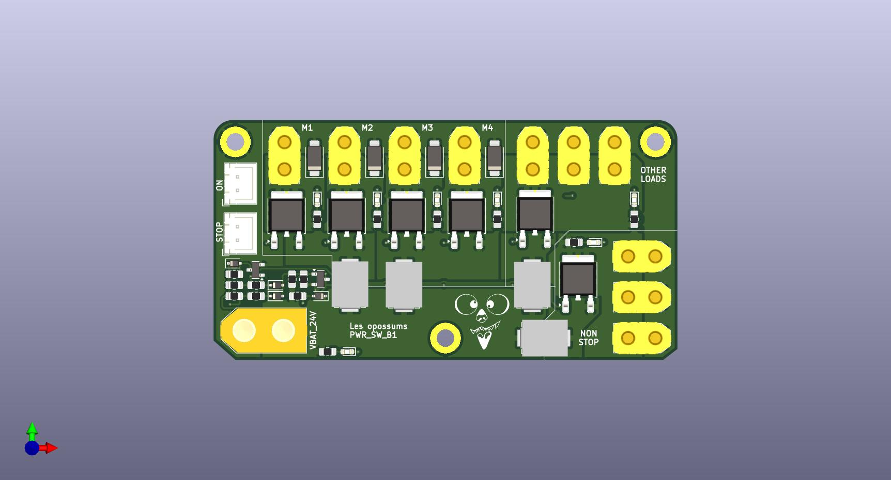

# Power Switch Board - B1

## Description
This board serves as a power switch for the robot power supplies. It uses the battery as an input (24 V).
Two discrete inputs control the activation of the outputs: emergency stop (STOP) and on/off (ON).

All outputs are commanded by the ON input, while others are also subject to the STOP. The outputs are listed below.
- ON + STOP:
    - Motors 1, 2, 3, and 4.
    - Other loads (3 connectos), reserved for actuators (moving parts of the robot).
- ON only: Non stop loads (3 connectors), reserved for robot logics.

Every output has a corresponding LED for debug. Motors 1 and 2 are connected to one fuse, Motors 3 and 4 to another one. Both other outputs have reserved fuses.

